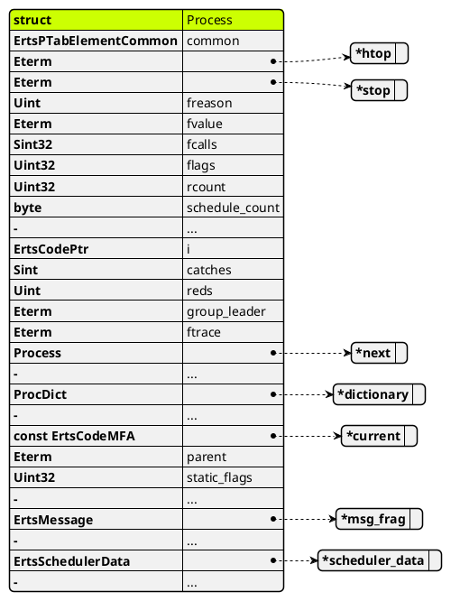
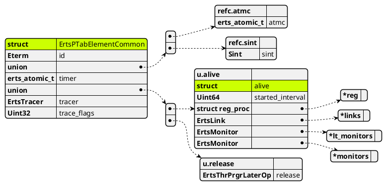
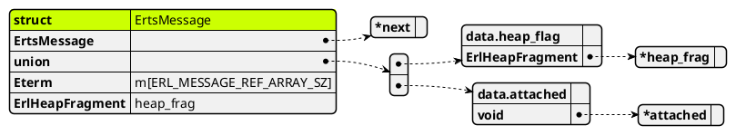
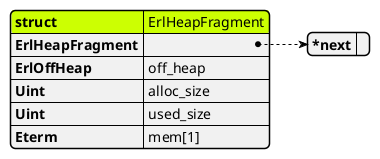
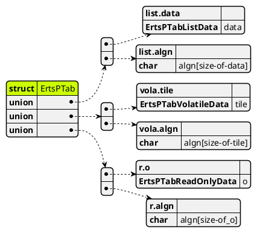

データ構造
==========

Process
-------
erts/emulator/beam/erl_process.h

```c
struct process {
    ErtsPTabElementCommon common; /* *Need* to be first in struct */

    /* Place fields that are frequently used from BEAMASM instructions near the
     * beginning of this struct so that a shorter instruction can be used to
     * access them. */
    /* These are paired to exploit the STP instruction in the ARM JIT. */
    Eterm *htop;                /* Heap top */
    Eterm *stop;                /* Stack top */

    /* These are paired to exploit the STP instruction in the ARM JIT. */
    Uint freason;               /* Reason for detected failure. */
    Eterm fvalue;               /* Exit & Throw value (failure reason) */
    Sint32 fcalls;              /* Number of reductions left to execute.
                                 * Only valid for the current process while it
                                 * is executing. */
    Uint32 flags;               /* Trap exit, etc */
    /* End of frequently used fields by BEAMASM code. */

    Uint32 rcount;              /* Suspend count */
    byte schedule_count;        /* Times left to reschedule a low prio process */

    ...

    ErtsCodePtr i;              /* Program counter. */
    Sint catches;               /* Number of catches on stack */
    Uint reds;                  /* No of reductions for this process  */
    Eterm group_leader;         /* Pid in charge (can be boxed) */
    Eterm ftrace;               /* Latest exception stack trace dump */

    Process *next;              /* Pointer to next process in run queue */

    ...

    ProcDict *dictionary;        /* Process dictionary, may be NULL */

    ...

    const ErtsCodeMFA* current; /* Current Erlang function, part of the
                                 * funcinfo:
                                 *
                                 * module(0), function(1), arity(2)
                                 *
                                 * (module and functions are tagged atoms;
                                 * arity an untagged integer).
                                 */

    /*
     * Information mainly for post-mortem use (erl crash dump).
     */
    Eterm parent;               /* Pid of process that created this process. */
    Uint32 static_flags;        /* Flags that do *not* change */

    ...

    ErtsMessage *msg_frag;	/* Pointer to message fragment list */

    ...

    ErtsSchedulerData *scheduler_data;

    ...
}
```

ErtsPTabElementCommon
---------------------
erts/emulator/beam/erl_ptab.h

```c
typedef struct {
    Eterm id;
    union {
    	erts_atomic_t atmc;
       	Sint sint;
    } refc;
    erts_atomic_t timer;
    union {
    	/* --- While being alive --- */
    	struct {
    	    Uint64 started_interval;
    	    struct reg_proc *reg;
    	    ErtsLink *links;
             /* Local target monitors, double linked list
                contains the remote part of local monitors  */
            ErtsMonitor *lt_monitors;
             /* other monitors, rb tree */
    	    ErtsMonitor *monitors;
    	} alive;
    	/* --- While being released --- */
    	ErtsThrPrgrLaterOp release;
    } u;
    ErtsTracer tracer;
    Uint32 trace_flags;
} ErtsPTabElementCommon;
```

ErtsMessage
-----------
erts/emulator/beam/erl_message.h

```c
typedef struct erl_mesg ErtsMessage;

...

#define ERL_MESSAGE_REF_FIELDS__			\
    ErtsMessage *next;	/* Next message */		\
    union {						\
	    ErlHeapFragment *heap_frag;			\
	    void *attached;					\
    } data;						\
    Eterm m[ERL_MESSAGE_REF_ARRAY_SZ]

...

struct erl_mesg {
    ERL_MESSAGE_REF_FIELDS__;

    ErlHeapFragment hfrag;
};
```

ErlHeapFragment
---------------
erts/emulator/beam/erl_message.h

```c
/*
 * This struct represents a heap fragment, which is used when there
 * isn't sufficient room in the process heap and we can't do a GC.
 */

typedef struct erl_heap_fragment ErlHeapFragment;
struct erl_heap_fragment {
    ErlHeapFragment* next;	/* Next heap fragment */
    ErlOffHeap off_heap;	/* Offset heap data. */
    Uint alloc_size;		/* Size in words of mem */
    Uint used_size;		/* With terms to be moved to heap by GC */
    Eterm mem[1];		/* Data */
};
```

ErtsPTab
--------
erts/emulator/beam/erl_ptab.h

```c
typedef struct {
    /*
     * Data mainly modified when someone is listing
     * the content of the table.
     */
    union {
	ErtsPTabListData data;
	char algn[ERTS_ALC_CACHE_LINE_ALIGN_SIZE(sizeof(ErtsPTabListData))];
    } list;

    /*
     * Frequently modified data.
     */
    union {
	ErtsPTabVolatileData tile;
	char algn[ERTS_ALC_CACHE_LINE_ALIGN_SIZE(sizeof(ErtsPTabVolatileData))];
    } vola;

    /*
     * Read only data.
     */
    union {
	ErtsPTabReadOnlyData o;
	char algn[ERTS_ALC_CACHE_LINE_ALIGN_SIZE(sizeof(ErtsPTabReadOnlyData))];
    } r;
} ErtsPTab;
```

Eterm
------
erts/emulator/beam/sys.h
```c
/*
** Data types:
**
** Eterm: A tagged erlang term (possibly 64 bits)
...
*/

#if SIZEOF_VOID_P == SIZEOF_LONG
typedef unsigned long Eterm erts_align_attribute(sizeof(long));
...
#elif SIZEOF_VOID_P == SIZEOF_INT
typedef unsigned int Eterm erts_align_attribute(sizeof(int));
...
#elif SIZEOF_VOID_P == SIZEOF_LONG_LONG
typedef unsigned long long Eterm erts_align_attribute(sizeof(long long));
...
#else
#error Found no appropriate type to use for 'Eterm', 'Uint' and 'Sint'
#endif
```
