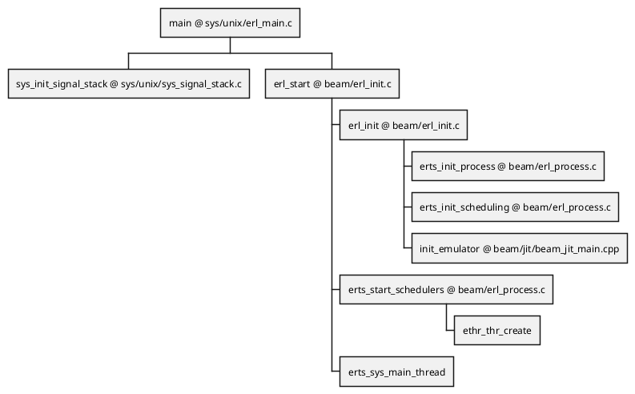

## エントリーポイント

### callstacks



### main
sys/unix/erl_main.c
```c
int
main(int argc, char **argv)
{
    sys_init_signal_stack();
    
    erl_start(argc, argv);
    return 0;
}
```

### sys_init_signal_stack
sys/unix/sys_signal_stack.c
```c
#if (defined(BEAMASM) && defined(NATIVE_ERLANG_STACK))

...

#else

void sys_init_signal_stack(void) {
    /* Not required for this configuration. */
}

...

#endif
```

### erl_start
beam/erl_init.c
```c
void
erl_start(int argc, char **argv)
{
    ...
    
    erl_init(...);
    
    ...

    erts_start_schedulers();
    
    erts_sys_main_thread();
}
```

### erl_init
beam/erl_init.c
```c
static void
erl_init(...)
{
    ...

    erts_init_process(ncpu, proc_tab_sz, legacy_proc_tab);
    erts_init_scheduling(...);

    ...
    
    init_emulator();

    ...
}
```

### erts_init_process
beam/erl_process.c

### erts_init_scheduling
beam/erl_process.c
```c
void
erts_init_scheduling(...)
{
    ...
}
```

### init_emulator
beam/jit/beam_jit_main.cpp

### erts_start_schedulers
beam/erl_process.c
```c
void
earts_start_schedulers(void)
{
    ...
    
    if (erts_runq_supervision_interval) {
        ...
        res = ethr_thr_create(&runq_supervisor_tid,
                              runq_supervisor,
                              NULL,
                              &opts);
        ... 
    }
    
    ...
    
    for (ix = 0; ix < erts_no_schedulers; ix++) {
        ...
        res = ethr_thr_create(&esdp->tid, sched_thread_func, (void *)esdp, &opts);
        ...
    }

    {
        for (ix = 0; ix < erts_no_dirty_cpu_schedulers; ix++) {
            ...
            res = ethr_thr_create(&esdp->tid, sched_dirty_cpu_thread_func, (void *)esdp, &opts);
            ... 
        }
        for (ix = 0; ix < erts_no_dirty_io_schedulers; ix++) {
            ...
            res = ethr_thr_create(&esdp->tid, sched_dirty_io_thread_func, (void *)esdp, &opts);
            ... 
        }
    }
    
    ix = 0;
    while (ix < erts_no_aux_work_threads) {
        ...
        res = ethr_thr_create(&tid, aux_thread, (void *) (Sint) ix, &opts);
        ...
    }
    
    ...
    
    for (ix = 0; ix < erts_no_poll_threads; ix++) {
        ...
        res = ethr_thr_create(&tid, poll_thread, (void *) bpt, &opts);
        ...
    }
}
```
