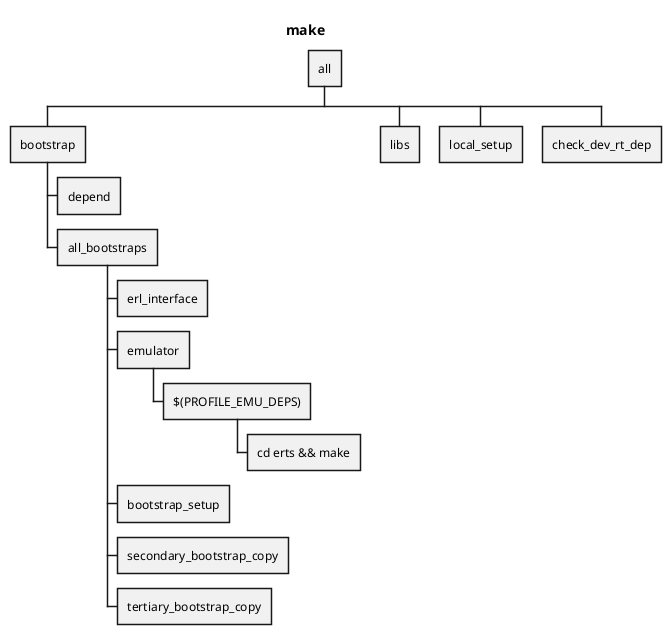
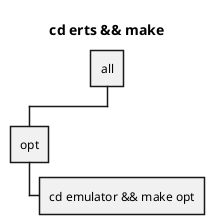
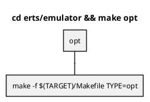
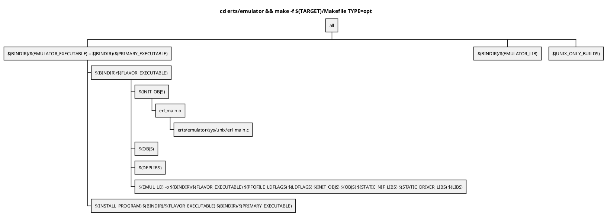

Makeのダイアグラム
==================

#### make

| 環境変数  | 値                          |
|-----------|-----------------------------|
| TARGET    | aarch64-apple-darwin22.5.0  |
| TYPES     | opt debug ... |
| FLAVORS   | emu jit                     |
| EMULATOR  | beam                        |

#### cd erts && make

#### cd erts/emulator && make opt

#### cd erts/emulator && make -f $(TARGET)/Makefile TYPE=opt

| 環境変数            | 値                                   |
|---------------------|--------------------------------------|
| FLAVOR              | TODO                                 |
| TYPEMAKER           | blank                                |
| BINDIR              | $(ERL_TOP)/bin/$(TARGET)             |
| EMULATOR_EXECUTABLE | beam.smp                             |
| EMULATOR_LIB        | libbeam.a                            |
| PRIMARY_EXECUTABLE  | beam.smp                             |
| FLAVOR_EXECUTABLE   | beam                                 |
| INSTALL_PROGRAM     | $(INSTALL)                           |
| INSTALL             | /opt/homebrew/bin/ginstall -c        |
| INIT_OBJS           | $(OBJDIR)/erl_main.o $(PRELOAD_OBJS) |
| OBJS                | $(PROF_OBJS)                         |

`ginstall (source) (dest)` : `source` を `dest` にコピーする
`-c`オプション: 無視する

