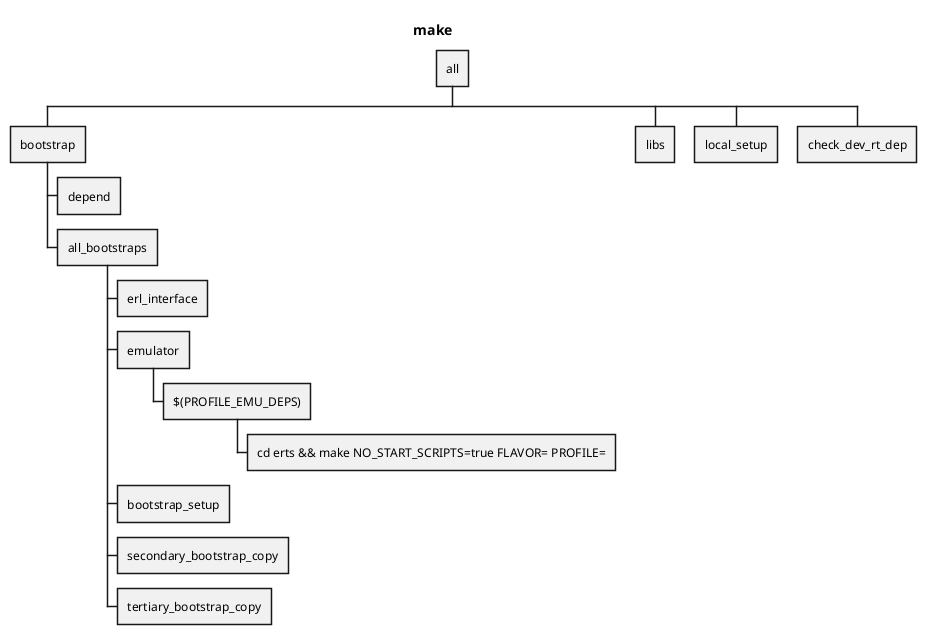
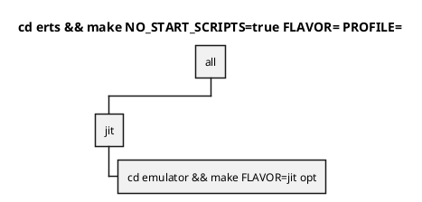
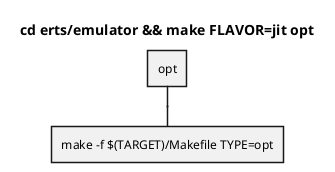
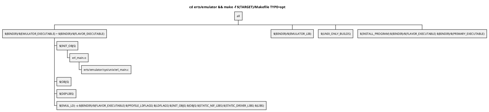

Makeのダイアグラム
==================

#### make

| ENV              | VAL                               | source                           |
|------------------|-----------------------------------|----------------------------------|
| TARGET           | aarch64-apple-darwin22.5.0        | $(ERL_TOP)/make/target.mk        |
| TYPES            | opt debug lcnt valgrind asan gcov | $(ERL_TOP)/make/$(TARGET)/otp.mk |
| DEFAULT_TYPES    | opt                               | $(ERL_TOP)/make/$(TARGET)/otp.mk |
| FLAVORS          | emu jit                           | $(ERL_TOP)/make/$(TARGET)/otp.mk |
| PRIMARY_FLAVORS  | jit                               | $(ERL_TOP)/make/$(TARGET)/otp.mk |
| EMULATOR         | beam                              |                                  |
| PROFILE          | blank                             | Makefile                         |
| PROFILE_EMU_DEPS | blank                             | Makefile                         |

#### cd erts && make NO_START_SCRIPTS=true FLAVOR= PROFILE=

| ENV            | VAL   | source                           |
|----------------|-------|----------------------------------|
| FLAVOR         | blank | ?                                |
| PRIMARY_FLAVOR | jit   | $(ERL_TOP)/make/$(TARGET)/otp.mk |
| PROFILE        | blank | ?                                |

#### cd erts/emulator && make FLAVOR=jit opt

#### cd erts/emulator && make -f $(TARGET)/Makefile TYPE=opt

| ENV                 | VAL                                  | source                             |
|---------------------|--------------------------------------|------------------------------------|
| FLAVOR              | blank                                |                                    |
| TYPEMAKER           | blank                                |                                    |
| BINDIR              | $(ERL_TOP)/bin/$(TARGET)             |                                    |
| EMULATOR_EXECUTABLE | beam = $(FLAVOR_EXECUTABLE)          | $(ERL_TOP)/erts/$(TARGET)/Makefile |
| EMULATOR_LIB        | libbeam.a                            |                                    |
| PRIMARY_EXECUTABLE  | beam.smp                             |                                    |
| FLAVOR_EXECUTABLE   | beam                                 |                                    |
| INSTALL_PROGRAM     | $(INSTALL)                           | $(ERL_TOP)/make/$(TARGET)/otp.mk   |
| INSTALL             | /opt/homebrew/bin/ginstall -c        | $(ERL_TOP)/make/$(TARGET)/otp.mk   |
| INIT_OBJS           | $(OBJDIR)/erl_main.o $(PRELOAD_OBJS) |                                    |
| OBJS                | $(PROF_OBJS)                         |                                    |

`ginstall (source) (dest)` : `source` を `dest` にコピーする
`-c`オプション: 無視する

